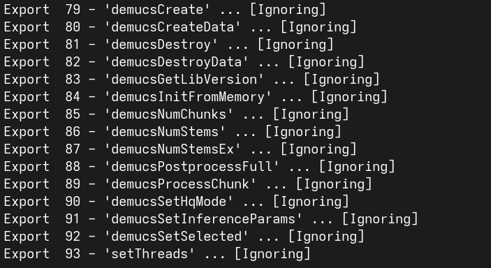
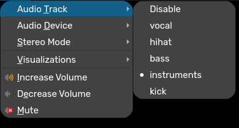

# `vdjstems_cli` - idek i cant come up with any good names

# Explanation

This is basically a tool I made to help extract stems for music that I use to DJ. (and also a quick read on anyone whos interested in where most stem seperation tools work)

# Requirements

* Python 3.6+ (3.13.3 seems to work the best)
* FFmpeg
* Definitely a good GPU or CPU (CPU is slower but works)

# Fetch Dependencies
```
pip install -r requirements.txt
```
Also if you have a NVIDIA GPU (CUDA) or a AMD GPU (ROCm) (idk abt Intel GPUs ¯\_(ツ)_/¯ ) go [here](https://pytorch.org/get-started/locally/) and paste the command it gives you (needed to better performance)

# How to use
```
python vdjstems.py [audio files or folder(s))] -o [output folder] -m [model]
```

## Context (for this project)

* Have a terrible GPU on my desktop (1050 Ti)
  * its better than my laptop (MX350)
* Run the stem seperation on VirtualDJ
* Realize it doesnt like my gpu without me selecting "Lower priority" or "Prepare with reduced quality" ("Stem engine error" very generic error thx for telling me whats wrong)
* Remember I made beats and I use FL Studio with its built in stem seperation tool
* Do a quick little research on where the files are
* Use `winedump` on `stemextractor.dll` (you can find this in `(INSERT_FL_USER_FOLDER_LOC)/Downloads/Optional Features/Stem extractor Windows` or `Documents/Image-Line/Downloads/Optional Features/Stem extractor Windows`)
* 
  * `demucs` - 🤔 that name sounds [familiar](https://github.com/facebookresearch/demucs?tab=readme-ov-file)
* Realizes that FL Studio uses a Facebook (the logo on github is meta but its still called facebookresearch) research project for extracting stems
  * "wait i can do this myself"
  * "now how does VirtualDJ seperate its stems and places it so it can easily use it later"
    * "idk how it seperates it"
* Go find a random song on my laptop that got extracted by VirtualDJ a while ago
  * realizes its still a audio file
  * open VLC
  * 
    * its just a audio file with different audio channels (more precisely a MPEG-4 AAC Matroska file at 48.00 kHz) 🤦
      * i honestly thought it was encoded different but yk (✨ dont reinvent the wheel ✨)
    * "i can easily do this myself with a python script"

# Warning
* This project is not affiliated with Image-Line or VirtualDJ.
* May not work on all songs or audio files.
